### Procedure

<b>Step 1: Observe the Real-Time Traffic View</b>

 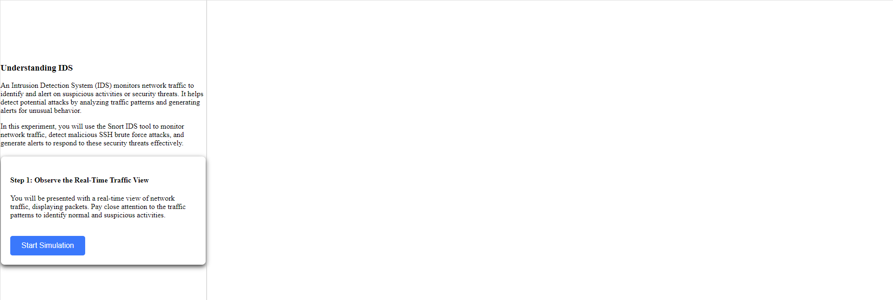
 
<b>Step 2: Identifying Normal Traffic</b>

 <li>observe normal traffic patterns, such as HTTP requests, DNS queries. You can also use the filter option to view specific types of traffic based on protocol.</li>
 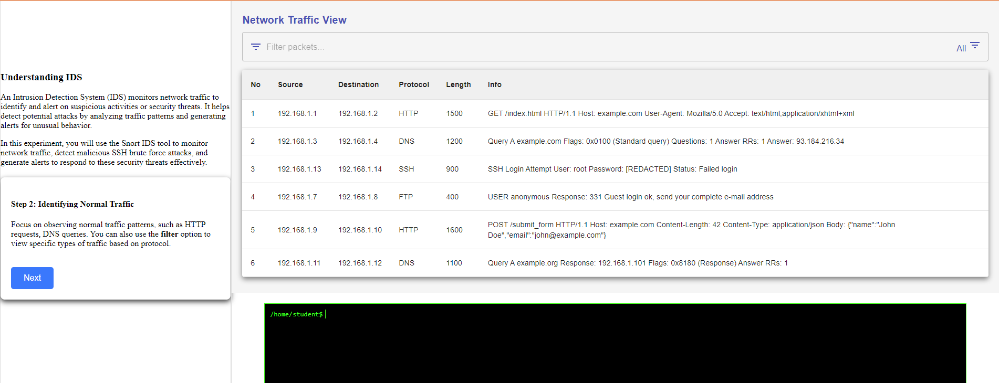
 
<b>Step 3 :Save the Logs</b>

 <li>click on the Save Log button to  save the captured logs from the network traffic view, ensuring that the file is saved with a <b>.pcap </b>extension for proper analysis.</li>
  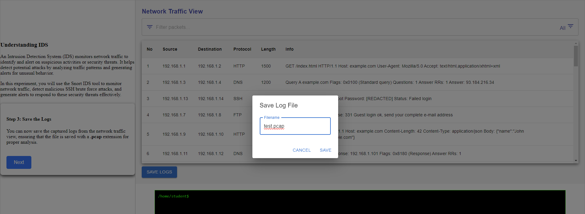
  
<b>Lets start to setup snort</b> 

  <li>Follow the commands to analyze the network traffic</li>
   <li>Click on the snort command , it will be copied to the clipboard , paste the command into the terminal </li>
  
<b>Step 4:  To set up Snort, navigate to /etc/snort/snort.conf</b>

  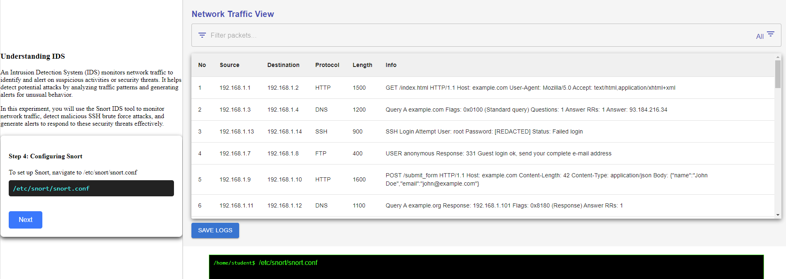
  
<b>Step 5:  after configuring Snort, start the Snort service to begin monitoring network traffic.</b>

   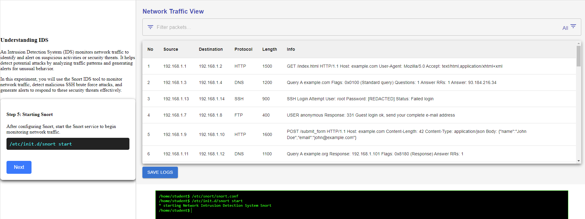
  
 <b>Step 6: use the following command to create a rule.</b>

      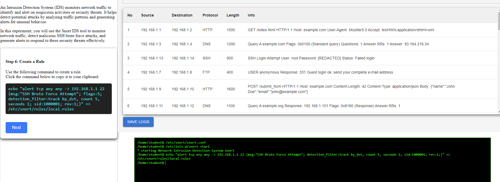
    
<b>Step 7: List the File Content to Ensure the Rule Has Been Saved Correctly</b>

      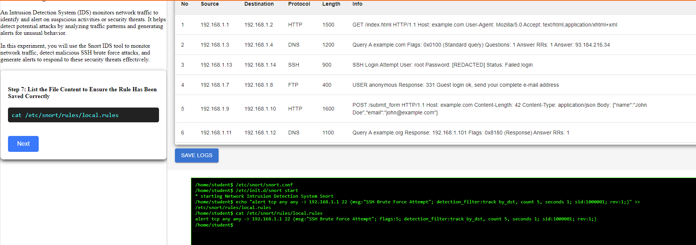
  
<b>Step 8: Analyzing the PCAP File</b>

    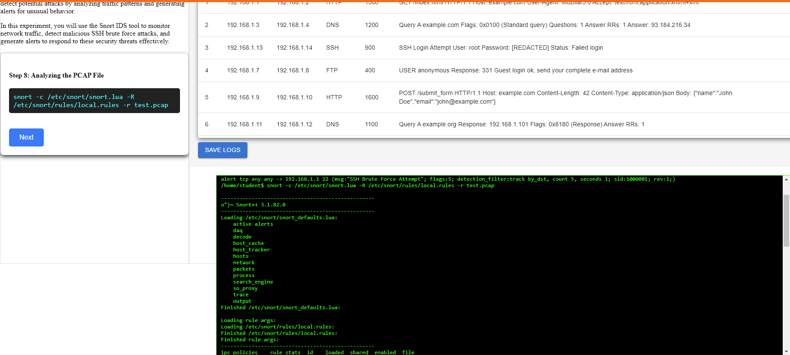

<b>Step 9: View the Generated Alerts After Analyzing with Snort</b>

<li>observe the malicious logs , scroll down the logs to identify the continous alerts.</li>
 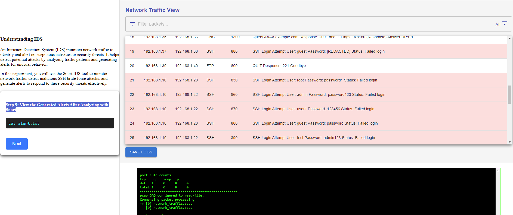
<li><b>cat alert.txt </b>is used to view the alerts that Snort has recorded in the alert.txt file.</li>
 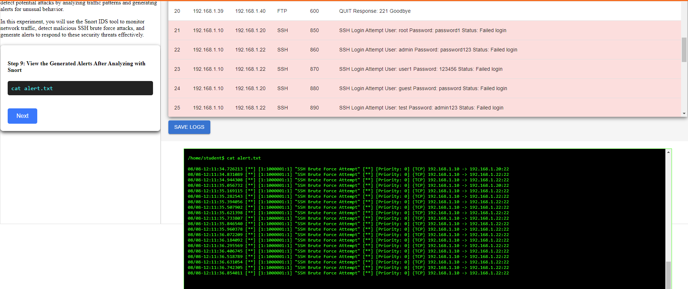
 
<b>Step 10: Investigating Malicious Activity</b>

 <li>Click on any highlighted log to investigate the malicious actor's IP address and gather more information, such assource and destination IPs, protocol,Payload,Flag,Severity</li>
  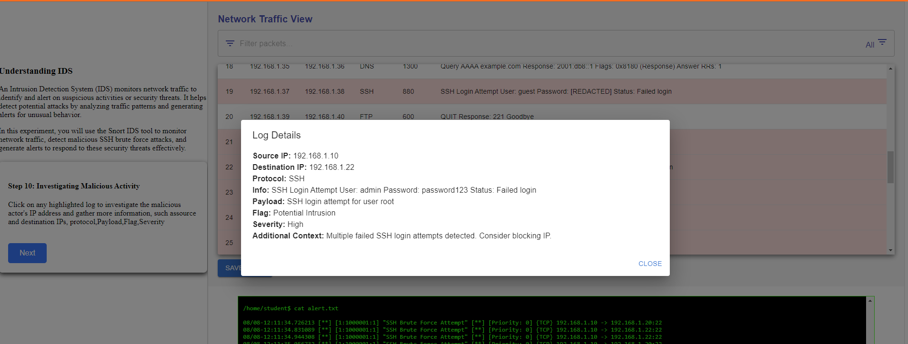

In conclusion, you effectively utilized Snort to analyze network traffic and identify malicious SSH brute force attacks amidst normal activity. By carefully examining traffic patterns and applying targeted Snort commands, you were able to successfully differentiate between benign and malicious logs.
